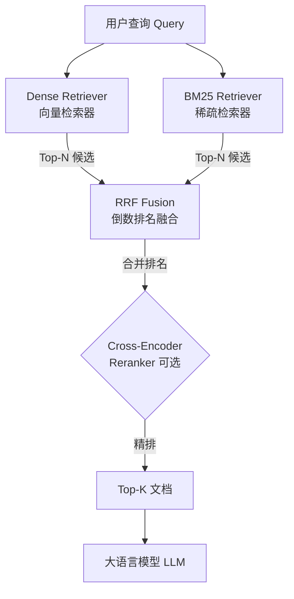

纯向量检索（Dense Retrieval）在处理 GPT-4o、RFC 2616、HTTP 404 这类精确术语时往往失效——它们在嵌入空间里没有稳定的语义锚点；而纯 BM25 则在同义词、跨语言、口语化查询面前束手无策。混合检索（Hybrid Search）将两者并行，各取所长，是生产级 RAG 系统的默认选择。

---

## 一、两类检索范式的深入对比

### 1.1 向量检索（Dense Retrieval）

向量检索将查询和文档分别编码为高维稠密向量，通过余弦相似度或内积在向量空间中寻找最近邻。其核心优势是**语义理解**：即使表述不同，只要含义接近，相似度就高。跨语言检索（中文查询匹配英文文档）也天然支持。

核心依赖：
- **嵌入模型（Embedding Model）**：text-embedding-3-large、BGE-M3 等
- **向量数据库（Vector Database）**：Pinecone、Weaviate、Milvus、pgvector
- **近似最近邻算法（ANN）**：HNSW、IVF、ScaNN

局限性：对专有名词、型号编号、代码片段等字面精确匹配场景表现差；嵌入模型训练时未见过的新术语会退化为随机向量。

### 1.2 稀疏检索 BM25（Sparse Retrieval）

BM25（Best Match 25）是基于 TF-IDF 思想的经典词频排序模型，对于文档 D 和查询 Q，其评分公式为：

```
score(D, Q) = Σ IDF(qi) × f(qi,D)×(k1+1) / (f(qi,D) + k1×(1 - b + b×|D|/avgdl))
```

其中：
- `f(qi, D)`：词 qi 在文档 D 中的词频（Term Frequency）
- `|D|`：文档长度，`avgdl`：语料平均文档长度
- `k1 ∈ [1.2, 2.0]`：词频饱和系数，防止高频词独占评分
- `b ≈ 0.75`：文档长度归一化系数
- `IDF(qi) = ln((N - n(qi) + 0.5) / (n(qi) + 0.5) + 1)`：逆文档频率

BM25 的精确字符串匹配特性使其在代码错误码、产品型号、人名地名等场景中表现稳健，且无需任何预训练模型，计算开销极低。

### 1.3 三路对比表

| 维度 | Dense（向量检索） | Sparse BM25（稀疏检索） | Hybrid（混合检索） |
|------|-----------------|----------------------|------------------|
| 语义理解 | 强 | 弱 | 强 |
| 精确词匹配 | 弱 | 强 | 强 |
| 跨语言支持 | 支持 | 不支持 | 部分支持 |
| 冷启动（无训练数据） | 差 | 好 | 好 |
| 新术语/专有名词 | 差 | 好 | 好 |
| 计算开销 | 高（需 GPU/ANN） | 低（倒排索引） | 中（两路并行） |
| 工程复杂度 | 中 | 低 | 高 |
| 典型适用场景 | 问答、语义搜索 | 代码、型号、日志检索 | 生产级 RAG |

---

## 二、混合检索架构

混合检索的核心思路是**并行召回 + 融合排序**：两路检索器独立运行，各自返回 Top-N 候选文档，再由融合算法合并排名，最终（可选）经过 Cross-Encoder 精排后送入 LLM。



该架构中，Dense Retriever 和 BM25 Retriever 可并行执行，不存在先后依赖，延迟约等于单路最慢者。融合层通常选用 RRF，精排层在对质量要求极高的场景中引入。

---

## 三、RRF 倒数排名融合（Reciprocal Rank Fusion）

### 3.1 公式与直觉

RRF 是目前生产中最常用的融合方法，由 Cormack et al. (2009) 提出：

```
RRF(d) = Σ_r  1 / (k + rank_r(d))
```

- `R`：所有检索器的结果列表集合
- `rank_r(d)`：文档 d 在检索器 r 中的排名（从 1 开始）
- `k`：平滑常数，默认值 **60**（经验值）

**为什么 k = 60？** 这是 Cormack 等人在 TREC 数据集上通过大量实验得到的最优经验值。k 的作用是平滑——若 k=0，第一名的权重是第二名的 2 倍，会让 Top-1 文档完全主导；k=60 则将差距压缩到约 1.6%，允许在多个列表中均排名靠前但单列表排名不高的文档浮出水面（跨列表信号聚合）。

**RRF 的核心优势**：只依赖**排名位置**，完全不关心原始分数的绝对值，因此不需要对 Dense 分数（余弦相似度，范围约 0~1）和 BM25 分数（无界正浮点数）做任何归一化。

### 3.2 Python 实现

```python
from typing import Dict, List, Tuple


def reciprocal_rank_fusion(
    ranked_lists: List[List[str]],
    k: int = 60
) -> List[Tuple[str, float]]:
    """
    倒数排名融合 (Reciprocal Rank Fusion)

    Args:
        ranked_lists: 多个检索器返回的文档 ID 排序列表
                      例如 [["doc3", "doc1", "doc5"], ["doc1", "doc3", "doc2"]]
        k: 平滑常数，默认 60（Cormack et al. 2009 经验值）

    Returns:
        按融合分数降序排列的 (doc_id, score) 列表
    """
    rrf_scores: Dict[str, float] = {}

    for ranked_list in ranked_lists:
        for rank, doc_id in enumerate(ranked_list, start=1):
            rrf_scores[doc_id] = rrf_scores.get(doc_id, 0.0) + 1.0 / (k + rank)

    # 按融合分数降序排列
    sorted_docs = sorted(rrf_scores.items(), key=lambda x: x[1], reverse=True)
    return sorted_docs


# 示例
if __name__ == "__main__":
    dense_results = ["doc3", "doc1", "doc5", "doc2", "doc4"]
    bm25_results  = ["doc1", "doc3", "doc2", "doc6", "doc4"]

    fused = reciprocal_rank_fusion([dense_results, bm25_results])
    print("融合排序结果:")
    for doc_id, score in fused:
        print(f"  {doc_id}: {score:.4f}")
```

---

## 四、其他融合方法

| 方法 | 原理 | 优势 | 劣势 |
|------|------|------|------|
| **RRF** | 基于排名位置加权求和 | 无需归一化，鲁棒性强 | 不可学习 |
| **线性加权（Linear Weighted）** | α·s_dense + (1-α)·s_sparse | 可调权重 | 分数需归一化，α 调参敏感 |
| **CombSUM** | 直接累加原始分数 | 实现简单 | 尺度差异大时失效 |
| **SPLADE** | 学习稀疏表示，端到端训练 | 效果最优 | 需要训练数据，推理成本高 |

RRF 在实际工程中胜出的原因：零超参调优（k=60 开箱即用）、对异常分数免疫、支持任意数量检索器叠加。

---

## 五、Cross-Encoder 精排（Reranking）

Cross-Encoder 将查询和文档**拼接后联合编码**，相比 Bi-Encoder（分别编码）能建模更精细的交互，排序质量更高，但计算复杂度为 O(N × L)（N 为候选数，L 为序列长度），不适合大规模粗召回。

典型精排流水线：

```
粗召回（Hybrid, Top-50）→ Cross-Encoder 精排 → Top-5 → LLM
```

```python
from typing import List, Tuple
from sentence_transformers import CrossEncoder

# 初始化 Cross-Encoder 模型
reranker = CrossEncoder("BAAI/bge-reranker-v2-m3")  # 支持中英双语


def rerank_with_cross_encoder(
    query: str,
    candidate_docs: List[str],
    top_k: int = 5
) -> List[Tuple[int, float]]:
    """
    使用 Cross-Encoder 对候选文档精排

    Args:
        query: 用户查询
        candidate_docs: 候选文档文本列表
        top_k: 返回前 K 个结果

    Returns:
        (原始索引, 分数) 的有序列表
    """
    pairs = [(query, doc) for doc in candidate_docs]
    scores = reranker.predict(pairs)

    ranked = sorted(enumerate(scores), key=lambda x: x[1], reverse=True)
    return ranked[:top_k]
```

---

## 六、BM25 实现选型

| 方案 | 适用场景 | 备注 |
|------|---------|------|
| `rank_bm25`（Python） | 原型开发、小规模语料（< 10 万文档） | 纯 Python，无需额外服务 |
| Elasticsearch | 中大规模生产，已有 ES 基础设施 | 内置 BM25，支持中文分词插件 |
| OpenSearch | AWS 生态，开源替代 ES | 同上 |
| Typesense | 轻量级实时搜索 | 支持混合搜索内置 |

```python
from typing import List, Tuple
from rank_bm25 import BM25Okapi
import jieba  # 中文分词


def build_bm25_index(documents: List[str]) -> BM25Okapi:
    """构建 BM25 索引（中文需先分词）"""
    # 重要：中文文档必须先做分词，否则退化为字级别 BM25
    tokenized_docs = [list(jieba.cut(doc)) for doc in documents]
    return BM25Okapi(tokenized_docs)


def bm25_search(
    bm25_index: BM25Okapi,
    query: str,
    top_k: int = 10
) -> List[Tuple[int, float]]:
    """BM25 查询，返回 (文档索引, 分数) 列表"""
    tokenized_query = list(jieba.cut(query))
    scores = bm25_index.get_scores(tokenized_query)
    top_indices = sorted(range(len(scores)), key=lambda i: scores[i], reverse=True)[:top_k]
    return [(idx, float(scores[idx])) for idx in top_indices]
```

---

## 七、完整混合检索实现

```python
from typing import Any, Dict, List, Optional, Tuple
from rank_bm25 import BM25Okapi
from sentence_transformers import CrossEncoder
import jieba
import numpy as np


def hybrid_search(
    query: str,
    documents: List[str],
    bm25_index: BM25Okapi,
    vector_store: Any,            # 任意支持 similarity_search_with_score 的向量库
    top_k: int = 5,
    rrf_k: int = 60,
    use_reranker: bool = False,
    reranker: Optional[CrossEncoder] = None,
) -> List[Tuple[str, float]]:
    """
    混合检索：BM25 + Dense + RRF 融合 + 可选 Cross-Encoder 精排

    Args:
        query:        用户查询文本
        documents:    原始文档列表（与 bm25_index 对应）
        bm25_index:   已构建的 BM25Okapi 索引
        vector_store: 向量数据库实例（需支持 similarity_search_with_score）
        top_k:        最终返回文档数量
        rrf_k:        RRF 平滑常数，默认 60
        use_reranker: 是否启用 Cross-Encoder 精排
        reranker:     CrossEncoder 模型实例

    Returns:
        (文档文本, 融合分数) 的有序列表
    """
    retrieve_n = top_k * 10  # 粗召回扩大 10 倍，为精排留余量

    # ── 1. BM25 稀疏检索 ──────────────────────────────────────────
    tokenized_query = list(jieba.cut(query))
    bm25_scores = bm25_index.get_scores(tokenized_query)
    bm25_top_indices = np.argsort(bm25_scores)[::-1][:retrieve_n].tolist()
    bm25_doc_ids = [f"doc_{i}" for i in bm25_top_indices]

    # ── 2. Dense 向量检索 ─────────────────────────────────────────
    dense_results = vector_store.similarity_search_with_score(query, k=retrieve_n)
    dense_doc_ids = [
        res[0].metadata.get("doc_id", f"vec_{i}")
        for i, res in enumerate(dense_results)
    ]

    # ── 3. RRF 融合 ───────────────────────────────────────────────
    all_lists = [bm25_doc_ids, dense_doc_ids]
    rrf_scores: Dict[str, float] = {}
    for ranked_list in all_lists:
        for rank, doc_id in enumerate(ranked_list, start=1):
            rrf_scores[doc_id] = rrf_scores.get(doc_id, 0.0) + 1.0 / (rrf_k + rank)

    fused_ranking = sorted(rrf_scores.items(), key=lambda x: x[1], reverse=True)

    # 映射回文档文本
    id_to_text: Dict[str, str] = {
        f"doc_{i}": documents[i] for i in bm25_top_indices
    }
    for i, (res, _) in enumerate(dense_results):
        doc_id = res.metadata.get("doc_id", f"vec_{i}")
        id_to_text[doc_id] = res.page_content

    candidates = [
        (id_to_text[doc_id], score)
        for doc_id, score in fused_ranking
        if doc_id in id_to_text
    ][:retrieve_n]

    # ── 4. Cross-Encoder 精排（可选）─────────────────────────────
    if use_reranker and reranker and candidates:
        texts = [doc for doc, _ in candidates]
        pairs = [(query, text) for text in texts]
        ce_scores = reranker.predict(pairs)
        reranked = sorted(zip(texts, ce_scores), key=lambda x: x[1], reverse=True)
        return [(text, float(score)) for text, score in reranked[:top_k]]

    return candidates[:top_k]
```

---

## 八、何时使用混合检索 vs 纯向量检索

| 场景 | 推荐方案 | 原因 |
|------|---------|------|
| 通用知识问答、语义相似查询 | 纯向量检索 | 语义泛化能力强，架构简单 |
| 代码库搜索（API 名、错误码） | 混合检索 | 精确词匹配关键，BM25 必要 |
| 产品文档（含型号、SKU） | 混合检索 | 型号字符串需精确匹配 |
| 法律/医疗文档（含专有术语） | 混合检索 | 术语精确性优先 |
| 多语言检索 | 混合检索 | Dense 处理语义跨语言，BM25 处理专有名词 |
| 语料 < 1 万文档，原型阶段 | 纯向量检索 | 混合检索工程复杂度不值得 |
| 对延迟极度敏感（< 50ms） | 纯向量检索 + ANN | BM25 + 融合增加约 20-40ms |

---

## 九、常见误区与最佳实践

### 常见误区

**误区 1：BM25 是"遗留技术"，现代系统不再需要**

BM25 至今仍是行业标准基线。Elasticsearch、OpenSearch 默认排序算法均基于 BM25。混合检索中，BM25 的贡献在精确词匹配场景下常常超过向量检索。

**误区 2：中文 BM25 不需要分词**

BM25 依赖词级别的 TF-IDF，如果不做中文分词直接按字符处理，语义单元被拆散，效果严重退化。生产中必须集成 jieba 或 HanLP 等中文分词器。

**误区 3：RRF 的 k 值越小越好**

过小的 k 会让融合结果退化为"单列表第一名投票"，失去跨列表聚合的意义。经验表明 k=60 在绝大多数场景下接近最优；若确需调优，建议在 [40, 80] 范围内用验证集搜索。

### 最佳实践

- **中文 BM25 必须分词**：将 jieba 分词集成到索引构建和查询解析两个环节。
- **粗召回倍数 = 10x**：两路各召回 10 × top_k，为 RRF 和精排留足候选空间。
- **Cross-Encoder 按需引入**：精排效果好但延迟高，对用户体验敏感的场景可做异步预热或仅对高价值查询启用。
- **监控两路各自的召回率**：定期评估 BM25 和 Dense 各自的贡献比，避免某路退化时未被发现。
- **向量数据库与 BM25 索引保持同步更新**：文档增删时两个索引必须同时更新，否则 RRF 结果集不一致。

---

## 十、面试常问

**Q1：RRF 中 k=60 是从哪里来的？为什么不用其他值？**

A：k=60 来自 Cormack、Clarke、Buettcher 2009 年在 TREC 数据集上的实验结果，是跨多个检索任务表现最稳定的经验值。其数学含义是：当文档排名为 1 时，得分为 1/61 ≈ 0.0164；排名为 2 时为 1/62 ≈ 0.0161，差距仅约 1.6%，有效防止单一 Top-1 主导融合结果。实践中可在 [40, 80] 小范围调优，但收益通常不显著。

**Q2：混合检索一定比纯向量检索效果好吗？**

A：不一定。在纯语义查询场景（如"有哪些提高专注力的方法？"）中，BM25 带来的信号是噪声，混合反而可能略差于纯向量。混合检索的收益集中在**包含精确词汇信号的查询**（专有名词、代码、数字标识符）。实际部署时应在验证集上对比，而非默认混合更优。

**Q3：除 RRF 外还有哪些常用融合方法？各自适用场景？**

A：（1）**线性加权**：α·s_dense + (1-α)·s_sparse，需归一化分数，适合有标注数据可调 α 的场景；（2）**CombSUM / CombMNZ**：直接累加分数，实现极简，但对分数尺度敏感；（3）**SPLADE**：端到端学习稀疏表示，效果最优但需要训练数据和更高推理成本；（4）**学习型融合（Learned Fusion）**：用小型神经网络拟合最优融合权重，适合有大量标注的垂直领域。RRF 胜在零调参、鲁棒性强，是没有标注数据时的首选。

**Q4：如何评估混合检索系统的效果？**

A：核心指标是 **NDCG@K**（Normalized Discounted Cumulative Gain）和 **MRR**（Mean Reciprocal Rank）。具体做法：（1）构建包含查询-相关文档标注对的评估集（可用 LLM 辅助标注）；（2）分别评估 Dense Only、BM25 Only、Hybrid 三路的 NDCG@5 和 NDCG@10；（3）用 RAGAS 或 TruLens 等框架端到端评估 RAG 管道的答案质量。若有 Cross-Encoder，还需单独评估精排前后的指标差异以判断其性价比。

---

