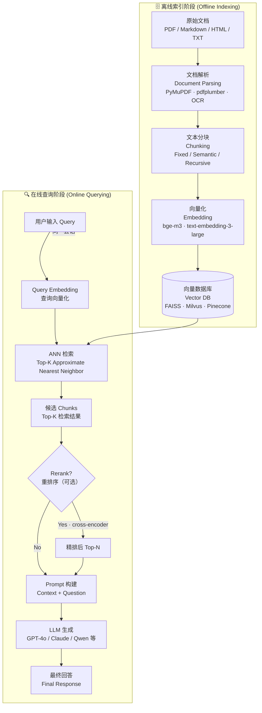

# RAG 完整流程实战

RAG（Retrieval-Augmented Generation，检索增强生成）让大语言模型在回答时能引用外部知识库，而非单靠训练时记忆——从根本上解决了**知识截止（Knowledge Cutoff）**、**私有数据无法访问**、**幻觉（Hallucination）** 三个核心痛点。

---

## 两阶段总览：离线索引 vs 在线查询

RAG 系统在运行上分为两个截然不同的阶段：

- **离线索引（Offline Indexing）**：一次性或定期执行，将原始文档处理成可检索的向量索引。
- **在线查询（Online Querying）**：每次用户请求时触发，完成检索、重排、生成的完整链路。



---

## 各阶段详解

### 阶段一：文档解析（Document Parsing）

**目标**：从原始文件中提取干净的纯文本，为后续分块奠定基础。

- **PDF**：优先使用 `PyMuPDF`（速度快，对数字 PDF 效果好）或 `pdfplumber`（表格提取更准确）。扫描件需要接入 OCR（如 PaddleOCR、Tesseract），但 OCR 质量直接决定后续所有环节的天花板。
- **Markdown / HTML**：去除标记语言即可，`markdownify` 或正则替换足够。
- **常见陷阱**：扫描件质量差（模糊、歪斜）会导致大量乱码文本流入索引，宁愿过滤掉低置信度 OCR 结果，也不要用"垃圾数据"污染向量库。

```python
import fitz  # PyMuPDF

def parse_pdf(file_path: str) -> str:
    """提取 PDF 纯文本，逐页拼接"""
    doc = fitz.open(file_path)
    pages = []
    for page in doc:
        text = page.get_text("text")
        if text.strip():
            pages.append(text)
    doc.close()
    return "\n\n".join(pages)
```

---

### 阶段二：文本分块（Chunking）

**目标**：将长文档切成大小适当、语义完整的片段（chunk），使向量检索粒度匹配实际问答需求。

分块策略详见《文本分块策略》专篇。调用模式示例：

```python
from langchain.text_splitter import RecursiveCharacterTextSplitter

splitter = RecursiveCharacterTextSplitter(
    chunk_size=512,
    chunk_overlap=64,
    separators=["\n\n", "\n", "。", "，", " "],
)
chunks = splitter.split_text(raw_text)
```

核心原则：**块大小应匹配内容粒度**——FAQ 类内容可以用小块（256 token），长篇技术文档建议 512–1024 token，`overlap` 通常取 chunk_size 的 10%–15%。

---

### 阶段三：向量化（Embedding）

**目标**：将每个 chunk 转换为稠密向量（dense vector），捕捉语义信息。

选型关键点：
- **语言支持**：中文场景推荐 `BAAI/bge-m3`（多语言）或 `text2vec-base-chinese`，而非直接使用仅优化了英文的模型。
- **维度权衡**：常见 768、1536、3072 维；维度越高检索精度可能越好，但存储和 ANN 查询开销随之增加。
- **批量调用**：每次 API 调用都有网络开销，务必批量处理（batch），同时注意速率限制（rate limit）。

```python
from openai import OpenAI

client = OpenAI()

def embed_batch(texts: list[str], model: str = "text-embedding-3-small") -> list[list[float]]:
    """批量向量化，以官方文档为准"""
    resp = client.embeddings.create(input=texts, model=model)
    return [item.embedding for item in resp.data]

# 将大列表分批处理，避免超过 API 单次限制
BATCH_SIZE = 100
all_embeddings = []
for i in range(0, len(chunks), BATCH_SIZE):
    batch = chunks[i : i + BATCH_SIZE]
    all_embeddings.extend(embed_batch(batch))
```

---

### 阶段四：向量存储（Vector Storage）

**目标**：将 `(id, embedding, metadata, raw_text)` 写入向量数据库，支持后续高效 ANN 检索。

`metadata` 至少应包含：文档来源（`source`）、页码（`page`）、chunk 序号（`chunk_index`），便于溯源和调试。

```python
# 以 Pinecone 为例，其他 VectorDB 接口类似
def upsert_chunks(chunks: list[str], embeddings: list[list[float]], source: str):
    vectors = []
    for i, (chunk, emb) in enumerate(zip(chunks, embeddings)):
        vectors.append({
            "id": f"{source}_chunk_{i}",
            "values": emb,
            "metadata": {
                "text": chunk,
                "source": source,
                "chunk_index": i,
            },
        })
    # index 为已初始化的 VectorDB 客户端，以官方文档为准
    index.upsert(vectors=vectors)
```

---

### 阶段五：检索（Retrieval）

**目标**：将用户 query 同样转为向量，在向量库中进行 ANN 搜索，取回 Top-K 个最相关的 chunks。

Top-K 通常初始设为 5–10，结合后续 Reranking 可适当放大（先取 20，再精排到 5）。

```python
def retrieve(query: str, top_k: int = 5) -> list[dict]:
    """检索最相关 chunks，以官方文档为准"""
    query_emb = embed_batch([query])[0]
    results = index.query(
        vector=query_emb,
        top_k=top_k,
        include_metadata=True,
    )
    return [
        {"text": m["metadata"]["text"], "score": m["score"], "source": m["metadata"]["source"]}
        for m in results["matches"]
    ]
```

---

### 阶段六：重排序（Reranking，可选）

**目标**：ANN 检索（双塔模型，Bi-encoder）速度快但精度有限；cross-encoder（交叉编码器）将 query 与每个 chunk 一起编码，精度更高但速度慢。常见做法：先用 ANN 检索 20–50 个候选，再用 cross-encoder 精排出最终 5 个。

典型模型：`BAAI/bge-reranker-v2-m3`、`cross-encoder/ms-marco-MiniLM-L-6-v2`。

**什么时候加**：对准确率要求高、允许额外延迟（通常增加 100–500ms）、文档集领域专业性强的场景优先考虑。

---

### 阶段七：Prompt 构建（Prompt Construction）

**目标**：将检索到的 chunks 注入 prompt，明确告知 LLM 信息来源和回答约束。

```python
RAG_PROMPT_TEMPLATE = """你是一个专业助手。请**仅基于以下参考内容**回答用户的问题。
如果参考内容中没有足够信息，请明确回复"根据现有资料无法回答"，不要凭空推测。

【参考内容 (Retrieved Context)】
{context}

【用户问题 (Question)】
{question}

【回答 (Answer)】"""

def build_prompt(question: str, chunks: list[dict]) -> str:
    context = "\n\n---\n\n".join(
        f"[来源: {c['source']}]\n{c['text']}" for c in chunks
    )
    return RAG_PROMPT_TEMPLATE.format(context=context, question=question)
```

**关键设计决策**：
- **明确限制来源**："仅基于以下内容"能有效抑制 LLM 混用训练知识。
- **无法回答时的 fallback**：显式定义兜底行为，防止模型生成"听起来合理但错误"的答案。
- **上下文位置**：检索内容放在问题之前，模型引用率更高。
- **分隔符**：用 `---` 等分隔多个 chunks，帮助模型区分不同来源。

---

### 阶段八：LLM 生成（Generation）

**目标**：将带有上下文的 prompt 发送给 LLM，获取最终答案。

建议开启**流式输出（Streaming）**以改善用户体验，避免长时间白屏等待。temperature 建议设为 0–0.3，减少随机性、提高答案可复现性。

---

## 端到端完整骨架代码（End-to-End Pipeline）

```python
"""
RAG 在线查询完整流程骨架
以下函数调用（get_embedding / vector_store.search / reranker.rerank / llm.chat）
为占位符，实际以所选库的官方文档为准。
"""

from dataclasses import dataclass

@dataclass
class RetrievedChunk:
    text: str
    source: str
    score: float

RAG_PROMPT = """你是一个专业助手，请仅基于以下参考内容回答问题。
若参考内容不足，回复"根据现有资料无法回答"，不要推测。

【参考内容】
{context}

【问题】
{question}

【回答】"""

def rag_query(
    user_query: str,
    top_k: int = 10,
    rerank_top_n: int = 5,
    use_rerank: bool = True,
) -> str:
    """
    RAG 在线查询主流程
    Args:
        user_query:   用户原始问题
        top_k:        ANN 检索候选数量
        rerank_top_n: Reranking 后保留数量
        use_rerank:   是否启用重排序
    Returns:
        LLM 生成的最终回答
    """

    # Step 1: Query 向量化 (Query Embedding)
    query_embedding = get_embedding(user_query)  # -> list[float]

    # Step 2: ANN 检索 (Approximate Nearest Neighbor Search)
    raw_results: list[RetrievedChunk] = vector_store.search(
        vector=query_embedding,
        top_k=top_k,
    )

    # Step 3: 重排序 (Reranking, optional)
    if use_rerank and raw_results:
        ranked_results = reranker.rerank(
            query=user_query,
            documents=[c.text for c in raw_results],
            top_n=rerank_top_n,
        )
        # 取精排后的 chunks（reranker 返回原始索引和新分数）
        final_chunks = [raw_results[r["index"]] for r in ranked_results]
    else:
        final_chunks = raw_results[:rerank_top_n]

    # Step 4: 构建 Prompt (Prompt Construction)
    context_str = "\n\n---\n\n".join(
        f"[来源: {c.source}]\n{c.text}" for c in final_chunks
    )
    prompt = RAG_PROMPT.format(context=context_str, question=user_query)

    # Step 5: LLM 生成 (Generation)
    final_answer: str = llm.chat(
        messages=[{"role": "user", "content": prompt}],
        temperature=0.1,
        stream=False,  # 生产环境建议改为 True，流式返回
    )

    return final_answer


# --- 示例调用 ---
if __name__ == "__main__":
    question = "RAG 系统中 Reranking 的作用是什么？"
    answer = rag_query(question, use_rerank=True)
    print(answer)
```

---

## 性能瓶颈与优化策略

| 阶段 | 瓶颈 | 优化策略 |
|---|---|---|
| 向量化（Embedding） | API 调用次数 / 速率限制 | 批量调用（batch_size=100+）；本地部署小型 Embedding 模型；增量更新（只对新增文档做 embedding） |
| ANN 检索 | 索引构建延迟 / 查询精度权衡 | HNSW 索引精度高（Milvus / Weaviate 默认）；IVF 构建快但精度略低；数据量 <100 万时 HNSW 是首选 |
| 重排序（Reranking） | cross-encoder 逐对计算开销 | 控制候选数量（top_k ≤ 50）；使用量化或蒸馏后的轻量 reranker；异步并行处理多 query |
| LLM 生成 | Token 处理延迟、首字延迟 | 开启 Streaming 改善感知体验；对高频 Query 缓存结果（Redis + 向量相似度判断是否命中缓存） |
| 整体链路延迟 | 多次串行网络请求 | Embedding + 初步过滤并行化；本地 Embedding 模型减少一次网络往返 |

---

## 常见误区与最佳实践

**误区一：Top-K 越大越好**
检索更多 chunks 会增加 Context 长度，LLM 处理噪声的能力下降，甚至触发 Context Overflow。最佳实践是"宽检索 + 精排"：先用较大 top_k 召回，再通过 Reranking 精简到 5 以内。

**误区二：Embedding 模型随便选**
中文文档用仅优化英文的模型会导致相似度分布崩塌，检索完全失效。始终在目标语言的 benchmark（如 CMTEB）上验证 Embedding 模型效果，再上线。

**误区三：Prompt 不写 fallback 指令**
不告知 LLM"当上下文不足时该怎么做"，模型会默默用训练知识填空，产生无法溯源的幻觉答案。必须显式定义兜底行为。

**最佳实践**：用 RAGAS、TruLens 等框架定期评估四个维度（Faithfulness / Answer Relevancy / Context Precision / Context Recall），建立自动化评估流水线，持续监控线上质量退化。

---

## 常见故障模式

**故障一：检索命中但答案仍然错误**
LLM 混用了检索内容和训练知识。解法：加强 prompt 限制指令，设 temperature=0，对比有无限制指令的答案差异来验证效果。

**故障二：检索完全没命中**
可能是 Chunking 策略不当（关键信息被切断）、query 与文档术语不一致、或 Embedding 模型对该领域支持差。解法：尝试 Query 扩展（用 LLM 生成多个同义 query 并取并集）；检查 embedding 相似度分数分布，定位是否存在系统性偏差。

**故障三：Context Overflow（上下文溢出）**
检索回来的 chunks 总 token 数超过 LLM context window。解法：降低 top_k；使用 Reranker 精排后只传最相关的 3–5 个；切换到支持更大上下文的模型。

**故障四：幻觉（检索内容存在但答案仍然捏造）**
LLM 忽略了提供的上下文，使用训练知识回答。解法：调整 prompt 语气（"你必须只使用以下内容"）；降低 temperature；评估不同模型的 instruction-following 能力。

---

## 面试常问

**Q：RAG 和 Fine-tuning 如何选择？**
A：两者解决不同问题。RAG 擅长引入**外部、动态、私有**知识，迭代成本低，数据安全可控，知识可实时更新；Fine-tuning 擅长调整模型的**行为风格、输出格式、领域语言感知**，但知识是静态烘焙进模型权重的，更新成本高。绝大多数业务场景优先 RAG；当有大量高质量标注数据、知识变化频率极低、需要极致的语言风格定制时再考虑 Fine-tuning。两者也可以组合：Fine-tuning 调整模型行为，RAG 补充最新知识。

**Q：Top-K 怎么设置最合理？**
A：没有固定答案，需要通过评估迭代。通常从 K=5 起步，在 Recall@K 和答案质量之间权衡。引入 Reranker 后可以放大初始 K（先检索 20–50，再精排到 3–5），以提高召回率而不增加送入 LLM 的噪声量。同时注意 LLM 的 context window 上限，确保所有 chunks 的 token 总数留有余量。

**Q：如何系统评估 RAG 质量？**
A：使用 RAGAS 等评估框架，从四个维度量化：**Faithfulness**（答案是否完全来自检索内容，衡量幻觉程度）、**Answer Relevancy**（答案是否准确回答了问题）、**Context Precision**（检索到的内容有多少是真正有用的，衡量噪声比例）、**Context Recall**（所有应该被检索到的相关信息是否都被召回）。线上还需关注端到端延迟（P50/P95）和用户满意度指标。

**Q：Query 改写（Query Rewriting）在什么情况下有价值？**
A：当用户输入的 query 与文档的表达方式存在较大 gap 时，如缩写、口语化表达、多义词等场景。可以用 LLM 将原始 query 改写成多个候选（HyDE - Hypothetical Document Embeddings 也是类似思路），分别检索后取并集，显著提升召回率。代价是增加一次 LLM 调用的延迟和成本。

---

> 部分内容参考《Hello-Agents》(datawhalechina)整理。
