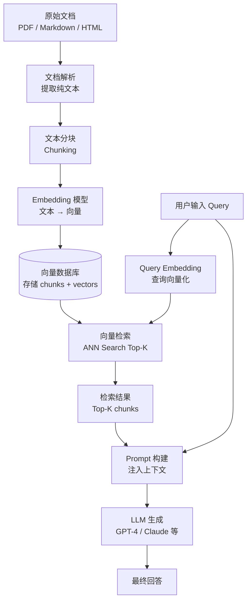

# RAG 完整流程实战

RAG（Retrieval-Augmented Generation）让 LLM 在回答时能引用外部知识，而不是单靠训练时的记忆——这解决了知识截止、私有数据无法访问、幻觉三个核心痛点。

---

## 完整流程图



整个 RAG 系统分为两个阶段：**离线索引**（上半部分，通常一次性或定期执行）和**在线查询**（下半部分，每次用户请求触发）。

---

## 各阶段详解

### 阶段一：文档解析

从原始文件提取纯文本。PDF 解析是难点，常见工具（如 PyMuPDF、pdfplumber）对扫描件处理不稳定，表格和图片需要额外处理。Markdown 和 HTML 相对简单，去掉标记语言即可。

实践注意：解析质量直接影响后续所有阶段，"垃圾进，垃圾出"。

### 阶段二：文本分块（Chunking）

参见《文本分块策略》篇。核心原则：块大小匹配内容类型，保留 overlap 避免信息截断。

### 阶段三：Embedding

将每个 chunk 转为稠密向量。选择 embedding 模型时关注两点：
- **维度**：常见 768、1536、3072，维度越高精度可能越好，存储和计算成本也越高
- **语言支持**：中文场景需要确认模型的中文能力，通用多语言模型不一定比专门的中文模型强

### 阶段四：向量存储

将 `(chunk_id, embedding, metadata, raw_text)` 写入向量数据库。metadata 至少包含文档来源、chunk 序号，方便溯源和调试。

### 阶段五：查询 + 检索

用户输入的 query 经过同一个 embedding 模型转为向量，在向量数据库中做 ANN 搜索，取 Top-K（通常 3–10 个）最相似的 chunks。

### 阶段六：Prompt 构建

把检索到的 chunks 拼入 prompt，告诉 LLM"基于以下内容回答"。这是 RAG 的关键一环，模板质量直接影响答案质量。

### 阶段七：LLM 生成

携带上下文的 prompt 发送给 LLM，生成最终回答。

---

## TypeScript 实现骨架

```typescript
// 以下为结构骨架，具体 SDK 调用以官方文档为准

interface Chunk {
  id: string;
  text: string;
  metadata: Record<string, string>;
}

// --- 离线索引阶段 ---
async function indexDocuments(chunks: Chunk[]) {
  for (const chunk of chunks) {
    // 1. 调用 embedding 模型
    const embedding = await getEmbedding(chunk.text);
    // 2. 写入向量数据库
    await vectorStore.upsert({
      id: chunk.id,
      values: embedding,
      metadata: { text: chunk.text, ...chunk.metadata },
    });
  }
}

// --- 在线查询阶段 ---
async function ragQuery(userQuery: string): Promise<string> {
  // 1. Query 向量化
  const queryEmbedding = await getEmbedding(userQuery);

  // 2. 向量检索
  const results = await vectorStore.query({
    vector: queryEmbedding,
    topK: 5,
    includeMetadata: true,
  });

  // 3. 提取检索到的文本
  const context = results.matches
    .map((m) => m.metadata?.text ?? "")
    .join("\n\n---\n\n");

  // 4. 构建 Prompt
  const prompt = buildRagPrompt(userQuery, context);

  // 5. 调用 LLM
  const response = await llm.chat(prompt);
  return response;
}
```

---

## RAG Prompt 模板

Prompt 的结构直接影响 LLM 能否正确引用检索内容。一个可用的模板：

```
你是一个专业助手。请仅基于以下参考内容回答用户的问题。
如果参考内容中没有相关信息，请明确说明"根据现有资料无法回答"，不要猜测。

【参考内容】
{retrieved_context}

【用户问题】
{user_query}

【回答】
```

几个关键设计决策：
- **明确限制来源**："仅基于以下内容"能有效抑制 LLM 使用训练知识瞎编
- **无法回答时的处理**：显式告知 LLM 不确定时该怎么做，否则它倾向于生成听起来合理的假答案
- **上下文位置**：将检索内容放在问题之前，LLM 通常能更好地引用

---

## 常见故障模式

### 故障一：检索命中但答案仍然错误

**原因**：检索到了相关文档，但 prompt 没有强调"以此为准"，LLM 混用了训练知识和检索内容。  
**解法**：加强 prompt 中的限制指令；用 temperature=0 减少随机性。

### 故障二：检索完全没命中

**原因可能有**：
- Chunking 策略不合适，关键信息被切断
- Query 和文档的表达方式差异大（术语不统一）
- Embedding 模型对该领域语言理解弱

**解法**：检查 embedding 相似度分布；尝试 Query 扩展（用 LLM 生成同义表达再检索）；调整 chunk 大小。

### 故障三：Context Overflow

检索回来的 chunks 总 token 数超过 LLM 的 context window 限制。

**解法**：减少 Top-K；对 chunks 做二次排序（Reranking），只取最相关的前 N 个；使用支持更大 context 的模型。

### 故障四：幻觉（检索内容有但答案仍然捏造）

LLM 忽略了提供的上下文，用自己的训练知识回答。

**解法**：调整 prompt 语气（"你必须只使用以下内容"）；降低 temperature；考虑模型本身的 instruction-following 能力差异。

---

## 性能考量

| 阶段 | 性能瓶颈 | 优化思路 |
|---|---|---|
| 离线索引 | Embedding API 调用次数 | 批量调用；异步并发；增量更新 |
| 向量检索 | ANN 索引构建和查询延迟 | 选合适索引（HNSW 精度高，IVF 构建快） |
| LLM 生成 | Token 处理延迟 | 流式输出改善体验；缓存高频 Query 结果 |
| 整体延迟 | 多次网络往返 | Embedding + 检索并行化；本地 embedding 模型 |

---

## 面试常问

**Q：RAG 和 Fine-tuning 怎么选？**  
A：RAG 擅长引入外部知识、实时更新，不修改模型本身；Fine-tuning 擅长调整模型的"行为风格"和特定领域的格式感知，但知识是静态烘焙进模型的。大多数业务场景优先 RAG，原因是迭代成本低、数据安全性好；Fine-tuning 适合已有大量高质量标注数据且知识变化频率低的场景。两者也可以结合。

**Q：Top-K 怎么定？**  
A：K 越大，召回越全，但 prompt 越长，LLM 处理噪声的难度越大。通常从 K=5 开始，通过评估答案相关性和召回率迭代。如果引入 Reranker，K 可以适当放大（先检索 20 个，Reranker 筛出最好的 5 个）。

**Q：如何评估 RAG 系统的质量？**  
A：主流评估框架（如 RAGAS）从四个维度量化：**Faithfulness**（答案是否忠于检索内容）、**Answer Relevancy**（答案是否回答了问题）、**Context Precision**（检索结果是否精准）、**Context Recall**（相关信息是否都被检索到）。
