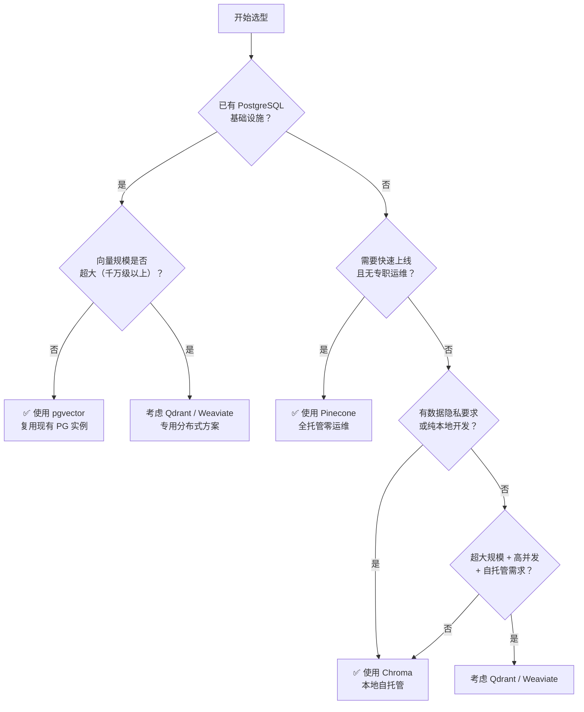

# 向量数据库选型：Pinecone / Chroma / pgvector

## 一、为什么需要向量数据库

在检索增强生成（RAG, Retrieval-Augmented Generation）系统中，文本、图像等非结构化数据首先经过嵌入模型（Embedding Model）转换为高维浮点向量，再通过**相似性搜索**（Similarity Search）找到语义上最接近的文档片段。这一流程的核心挑战在于：如何在数百万乃至数十亿条向量中，快速找到与查询向量距离最近的若干条记录。

### 传统数据库的局限

关系型数据库（MySQL、PostgreSQL）依赖 B-Tree 索引，擅长精确匹配和范围查询，但对高维向量的相似性检索力不从心。原因如下：

- **维度灾难（Curse of Dimensionality）**：向量维度通常在 768～3072 之间，B-Tree 的空间划分效率在高维空间中急剧退化。
- **全文索引不适用**：倒排索引（Inverted Index）基于词频统计，无法捕获语义相似性（如"苹果"与"水果"的关联）。
- **全量扫描代价高昂**：暴力计算每条记录与查询向量的余弦相似度（Cosine Similarity）或 L2 距离，时间复杂度为 O(n)，在大规模场景下不可接受。

向量数据库通过**近似最近邻**（ANN, Approximate Nearest Neighbor）算法，在牺牲极少精度的前提下，将查询复杂度降低至接近 O(log n)，同时支持元数据过滤（Metadata Filtering）和持久化存储，成为 RAG 系统的标准基础设施。

---

## 二、核心索引算法

### 2.1 HNSW（分层可导航小世界图）

HNSW（Hierarchical Navigable Small World）是目前最主流的 ANN 索引算法，基于图结构：

- 将向量构建为多层跳表式图，高层节点稀疏（用于粗粒度导航），底层节点稠密（用于精确比较）
- 查询时从高层入口节点出发，逐层向下贪心搜索，最终返回近似最近邻
- **特点**：查询召回率高、支持动态插入，但内存占用随向量数量线性增长

### 2.2 IVF（倒排文件索引）

IVF（Inverted File Index）基于聚类思想：

- 预先用 K-Means 将向量划分为若干簇（Cluster），构建倒排表
- 查询时仅搜索与查询向量最近的若干个簇，跳过大量不相关向量
- **特点**：构建速度快、内存占用低，但召回率略低于 HNSW，且需要预先确定簇数量

### 2.3 算法对比

| 维度 | HNSW | IVF |
|------|------|-----|
| 构建速度 | 较慢（图边与层的构建开销大） | 较快（K-Means 聚类后直接建表） |
| 查询召回率 | 高 | 中等（受 nprobe 参数影响） |
| 内存占用 | 高（图结构存储边信息） | 低（仅存储簇中心和倒排表） |
| 适用规模 | 中小规模到大规模均适用 | 超大规模、内存受限场景 |
| 动态更新 | 支持增量插入 | 需要重新训练或近似追加 |

---

## 三、三大主流方案详解

### 3.1 Pinecone

Pinecone 是一款**全托管云向量数据库**（Fully Managed Cloud Vector DB），提供 Serverless 和 Pod 两种模式：

- **Serverless 模式**：按查询量计费，无需预置资源，适合流量不均的场景
- **Pod 模式**：预置专用计算单元（Pod），适合延迟敏感的生产环境

**核心优势**：
- 零运维（Zero-Ops）：无需管理服务器、索引重建或备份
- 自动扩缩容，支持命名空间（Namespace）实现多租户隔离
- 原生支持混合搜索（稀疏 + 稠密向量）

**局限**：
- 数据存储于第三方，对数据主权敏感的场景需谨慎
- 免费层有容量上限，正式生产需付费
- 依赖互联网连接，离线/内网场景不适用

```python
import pinecone
from pinecone import Pinecone, ServerlessSpec

# 初始化客户端
pc = Pinecone(api_key="YOUR_API_KEY")

# 创建索引（仅首次）
if "my-index" not in pc.list_indexes().names():
    pc.create_index(
        name="my-index",
        dimension=1536,          # 与嵌入模型输出维度一致
        metric="cosine",         # 相似度度量方式
        spec=ServerlessSpec(cloud="aws", region="us-east-1")
    )

index = pc.Index("my-index")

# 插入向量（含元数据）
index.upsert(vectors=[
    {"id": "doc_001", "values": [0.1, 0.2, ...], "metadata": {"source": "wiki", "lang": "zh"}},
])

# 相似性查询（附带元数据过滤）
results = index.query(
    vector=[0.15, 0.18, ...],
    top_k=5,
    filter={"lang": {"$eq": "zh"}},
    include_metadata=True
)
```

---

### 3.2 Chroma

Chroma 是一款**开源向量数据库**，设计哲学是"开发者优先"：

- 支持纯内存模式（EphemeralClient）、本地持久化（PersistentClient）和客户端/服务器模式
- 默认使用 HNSW 索引（基于 hnswlib）
- 天然与 LangChain、LlamaIndex 集成

**核心优势**：
- 本地开发零成本，内存模式非常适合单元测试
- API 简洁，五分钟即可上手
- 完全开源，数据完全自控

**局限**：
- 生产环境需自行运维（容器化部署、监控、备份）
- 分布式集群支持尚不成熟，横向扩展能力有限

```python
import chromadb

# 内存模式（适合测试）
client = chromadb.EphemeralClient()

# 本地持久化模式（适合开发/小规模生产）
# client = chromadb.PersistentClient(path="./chroma_db")

# 创建集合（Collection 是多租户隔离的基本单元）
collection = client.get_or_create_collection(
    name="my_documents",
    metadata={"hnsw:space": "cosine"}  # 指定距离度量
)

# 插入文档（手动传入嵌入向量）
collection.add(
    ids=["doc_001", "doc_002"],
    embeddings=[[0.1, 0.2, ...], [0.3, 0.4, ...]],
    documents=["原始文本内容1", "原始文本内容2"],
    metadatas=[{"source": "wiki"}, {"source": "arxiv"}]
)

# 查询
results = collection.query(
    query_embeddings=[[0.15, 0.18, ...]],
    n_results=5,
    where={"source": "wiki"}   # 元数据过滤
)
```

---

### 3.3 pgvector

pgvector 是 PostgreSQL 的向量扩展，将向量搜索能力直接嵌入关系型数据库：

- 新增 `vector` 数据类型，支持 L2、内积、余弦距离运算
- 支持 HNSW 和 IVF Flat 两种索引类型
- 向量列与普通列共存，可在同一 SQL 查询中混合向量搜索和精确过滤

**核心优势**：
- 无需新增基础设施，复用现有 PostgreSQL 实例
- 原生 SQL 语法，JOIN、事务、权限管理一应俱全
- 元数据过滤直接用 WHERE 子句，无需学习新 API

**局限**：
- 向量规模超大时（如超千万量级）性能和内存压力显著
- 需要熟悉 PostgreSQL 运维（vacuuming、连接池、索引调优）

```sql
-- 安装扩展
CREATE EXTENSION IF NOT EXISTS vector;

-- 创建表（1536 维向量）
CREATE TABLE documents (
    id        BIGSERIAL PRIMARY KEY,
    content   TEXT,
    embedding vector(1536),
    source    VARCHAR(100),
    tenant_id UUID NOT NULL    -- 多租户隔离字段
);

-- 建立 HNSW 索引
CREATE INDEX ON documents
USING hnsw (embedding vector_cosine_ops)
WITH (m = 16, ef_construction = 64);

-- 相似性查询（余弦距离，结合元数据过滤）
SELECT id, content, 1 - (embedding <=> '[0.1,0.2,...]'::vector) AS similarity
FROM documents
WHERE source = 'wiki'
  AND tenant_id = 'tenant-uuid-here'
ORDER BY embedding <=> '[0.1,0.2,...]'::vector
LIMIT 5;
```

---

## 四、综合对比

| 维度 | Pinecone | Chroma | pgvector |
|------|----------|--------|----------|
| **类型** | 全托管云服务 | 开源本地/云 | PostgreSQL 扩展 |
| **上手难度** | 低（注册即用） | 很低（pip install） | 中（需要 Postgres 基础） |
| **本地开发** | 需联网，有限制 | 极佳（内存模式） | 需本地 Postgres 实例 |
| **生产扩展性** | 高（自动扩缩容） | 中（单节点为主） | 中（受 PG 垂直扩展限制） |
| **元数据过滤** | 支持（JSON 过滤语法） | 支持（where 字典） | 极强（原生 SQL WHERE） |
| **成本模型** | 按用量付费（SaaS） | 开源免费，自托管成本 | 复用现有 PG 成本 |
| **数据主权** | 数据在 Pinecone 云端 | 完全自控 | 完全自控 |
| **多租户** | Namespace 隔离 | Collection 隔离 | tenant_id 字段隔离 |
| **适合场景** | 快速上线、无运维团队 | 本地开发、原型、测试 | 已有 PG 基础、小中规模 |

---

## 五、选型决策流程



---

## 六、其他值得关注的方案

### Qdrant

Qdrant 是一款用 Rust 编写的高性能开源向量数据库，支持过滤感知（Filter-aware）的 HNSW 索引。其独特的 Payload（元数据）索引与向量搜索深度融合，在带有复杂过滤条件的查询场景下表现优秀。提供云托管服务和自托管两种模式，适合对性能和过滤需求都较高的团队。

### Weaviate

Weaviate 是一款面向 AI 原生应用的开源向量数据库，内置模块化架构，可直接集成各类嵌入模型（如 OpenAI、Cohere）。支持混合搜索（BM25 + 向量）、GraphQL 查询接口和多模态数据，适合需要在数据库层面整合模型调用的场景。

---

## 七、多租户模式设计

在 SaaS 类 RAG 应用中，多租户隔离是架构设计的核心问题：

| 方案 | 实现方式 | 隔离强度 | 成本 |
|------|----------|----------|------|
| **Pinecone** | Namespace 参数（同一索引内逻辑隔离） | 中（共享计算） | 按用量 |
| **Chroma** | 每个租户一个 Collection | 高（独立存储） | 资源乘以租户数 |
| **pgvector** | 同表 `tenant_id` 列 + WHERE 过滤 | 中（行级隔离） | 低（共享 PG 实例） |

对于安全要求极高的场景（如医疗、金融），建议采用"每租户独立实例"策略，即便成本更高，也能规避数据泄露风险。

---

## 八、常见误区与最佳实践

### 误区一：先选数据库，后评估规模

许多团队在原型阶段就引入重型向量数据库，结果为数千条向量付出过高的运维成本。**最佳实践**：原型阶段优先用 Chroma 内存模式或 pgvector，向量规模突破单机瓶颈时再迁移。

### 误区二：忽视元数据过滤需求

向量搜索不是孤立存在的。用户在搜索时往往需要按时间、用户、分类等条件过滤。**最佳实践**：在选型前先梳理过滤字段的数量和查询模式，Chroma 的 `where` 字典和 pgvector 的 SQL WHERE 都有各自的适用边界，应结合实际业务需求选择。

### 误区三：把 ANN 召回率等同于系统准确率

ANN 索引本身有召回率损失，但这往往不是 RAG 系统效果差的根本原因。**最佳实践**：先确保嵌入模型质量和分块（Chunking）策略合理，再调优 ANN 参数（如 `ef_search`）。

### 误区四：在生产环境直接使用 Chroma 内存模式

内存模式（EphemeralClient）的数据在进程退出后消失，仅适合测试。**最佳实践**：生产环境必须使用持久化模式，并配置定期备份。

---

## 九、面试常问

**Q1：ANN 与 KNN 有什么区别？向量数据库为什么用 ANN？**

A：KNN（K-Nearest Neighbor）是精确搜索，需要计算查询点与数据集中每个点的距离，时间复杂度为 O(n)，在大规模数据集下不可接受。ANN（Approximate Nearest Neighbor）通过预先构建索引结构（如 HNSW 的图、IVF 的簇），在查询时只遍历候选子集，以极小的召回率损失换取数量级的速度提升。在 RAG 场景中，召回到"足够好"的文档比召回"绝对最近"的文档更重要，因此 ANN 是工程上的合理权衡。

**Q2：为什么不用 MySQL 或 Elasticsearch 存储向量？**

A：MySQL 的 B-Tree 索引专为有序标量数据设计，对高维向量的相似性搜索没有加速作用，只能全表扫描。Elasticsearch 的倒排索引基于词频（TF-IDF/BM25），擅长关键词匹配，虽然新版本也支持向量搜索（dense_vector），但其设计初衷不是向量索引，在大规模高维场景下性能和内存效率不如专用向量数据库。专用向量数据库针对高维向量的存储布局、距离计算（SIMD 加速）和索引结构做了深度优化。

**Q3：HNSW 的内存占用为何较高？如何在生产中控制？**

A：HNSW 为每个向量节点维护多层图的出边列表（neighbor list），边数由参数 `m` 控制（通常为 16～64）。每条边需要存储邻居节点的 ID，加上原始向量本身，整体内存消耗随向量数和维度线性增长。控制策略包括：降低 `m` 参数（牺牲少量召回率）、使用标量量化（Scalar Quantization）压缩向量精度（如 float32 → int8），或选用 IVF 系列索引作为替代。

**Q4：多租户场景下如何选择隔离方案？**

A：隔离强度与成本之间存在权衡。行级隔离（如 pgvector 的 `tenant_id`）成本最低但隔离最弱，适合信任度较高的内部多租户；Collection 级隔离（Chroma）隔离较强，但资源随租户数线性增长；实例级隔离（每个租户独立部署）安全性最高，适合合规要求严格的场景。选型时需结合租户数量规模、安全合规要求和运维能力综合判断，通常从行级隔离起步，在安全压力增大时逐步迁移到更强的隔离模型。

---

> 部分内容参考《Hello-Agents》(datawhalechina)整理。
